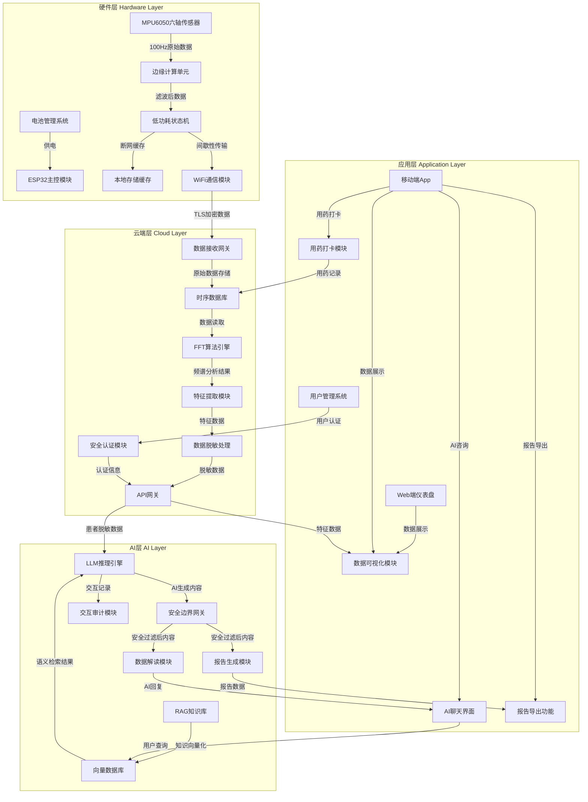

# TremorGuard 项目 Code Wiki

## 1. 项目概览

TremorGuard（震颤卫士）是一个针对震颤类疾病（如帕金森病）的智能监测与管理系统。该系统通过硬件采集、云端处理、AI分析和应用展示四个层级，为患者提供震颤数据监测、分析、管理和咨询服务。

在阅读代码前，建议先区分两套架构视角：

- 技术分层：硬件、云端、AI、应用
- 业务分层：身份与接入、监测与证据、AI 协同、干预与输出

技术分层帮助理解系统怎么搭建，业务分层帮助理解患者侧主业务怎么收口。如果你想先理解患者侧一期“接入、记录、AI 解读、计划与报告”的主链关系，先看 [docs/patient_business_architecture.md](/Users/peng/Documents/trae_projects/TremorGuard/docs/patient_business_architecture.md)。

**主要功能**：
- 实时震颤数据采集与分析
- 用药管理与提醒
- 医疗记录管理与报告生成
- AI 健康咨询
- 数据可视化与趋势分析
- 设备管理与状态监控

**典型应用场景**：
- 帕金森病患者的日常震颤监测
- 医生远程评估患者病情
- 患者自我健康管理
- 药物疗效评估

## 2. 目录结构

TremorGuard 项目采用分层架构设计，包含前端、后端、硬件工具和文档四个主要部分。前端负责用户界面与交互，后端处理数据存储与业务逻辑，硬件工具用于设备调试，文档则提供系统设计与使用指南。

```text
TremorGuard/
├── I2C_Scanner/           # ESP32 硬件调试工具
│   └── I2C_Scanner.ino    # I2C 设备扫描代码
├── docs/                  # 项目文档
│   ├── system_architecture.drawio  # 系统架构图
│   ├── system_architecture.md      # 系统架构文档
│   ├── patient_business_architecture.md # 患者侧一期业务架构稿
│   ├── 震颤卫士PRD构建指南.md       # 产品需求文档
│   └── 项目介绍.pdf              # 项目介绍
├── tremor-guard-backend/  # 后端服务
│   ├── app/               # 应用代码
│   │   ├── api/           # API 路由
│   │   ├── core/          # 核心配置
│   │   ├── db/            # 数据库
│   │   ├── models/        # 数据模型
│   │   ├── schemas/       # 数据验证
│   │   ├── services/      # 业务逻辑
│   │   └── main.py        # 应用入口
│   ├── alembic/           # 数据库迁移
│   ├── storage/           # 文件存储
│   └── pyproject.toml     # 项目配置
├── tremor-guard-frontend/ # 前端应用
│   ├── public/            # 静态资源
│   ├── src/               # 源码
│   │   ├── assets/        # 静态资源
│   │   ├── components/    # 组件
│   │   ├── hooks/         # 自定义钩子
│   │   ├── lib/           # 工具库
│   │   ├── mocks/         # 模拟数据
│   │   ├── pages/         # 页面
│   │   ├── types/         # 类型定义
│   │   ├── main.tsx       # 应用入口
│   │   └── router.tsx     # 路由配置
│   └── package.json       # 项目配置
└── AGENTS.md              # 项目开发指南
```

## 3. 系统架构

TremorGuard 系统采用四层架构设计，各层职责明确，数据流向清晰。

### 3.1 架构层次



### 3.2 各层详细说明

| 层级 | 核心组件 | 主要职责 | 技术特点 |
|------|----------|----------|----------|
| **硬件层** | ESP32主控模块、MPU6050传感器、边缘计算单元、低功耗状态机、本地存储缓存、WiFi通信模块、电池管理系统 | 数据采集、预处理、低功耗管理、数据传输 | 100Hz采样率、TLS加密传输、72小时断网缓存、7天电池续航 |
| **云端层** | 数据接收网关、时序数据库、FFT算法引擎、特征提取模块、数据脱敏处理、API网关、安全认证模块 | 数据接收与存储、震颤特征分析、数据安全处理、API服务 | FFT频谱分析、4-6Hz震颤识别、全链路加密、数据脱敏 |
| **AI层** | RAG知识库、向量数据库、LLM推理引擎、安全边界网关、数据解读模块、报告生成模块、交互审计模块 | 医学知识检索、智能推理、安全过滤、报告生成 | 权威医学知识库、语义检索、医疗安全边界、交互审计 |
| **应用层** | Web端仪表盘、移动端App、AI聊天界面、数据可视化模块、用药打卡模块、报告导出功能、用户管理系统 | 用户交互、数据展示、健康咨询、用药管理 | 响应式设计、实时数据可视化、自然语言交互、PDF报告导出 |

## 4. 核心功能模块

### 4.1 前端模块

#### 4.1.1 用户认证与授权
- **登录/注册**：用户账号创建与登录功能
- **会话管理**：JWT token 存储与自动刷新
- **路由守卫**：基于登录状态和完成度的路由保护

**关键文件**：
- [login-page.tsx](file:///Users/peng/Documents/trae_projects/TremorGuard/tremor-guard-frontend/src/pages/login-page.tsx)
- [register-page.tsx](file:///Users/peng/Documents/trae_projects/TremorGuard/tremor-guard-frontend/src/pages/register-page.tsx)
- [auth-provider.tsx](file:///Users/peng/Documents/trae_projects/TremorGuard/tremor-guard-frontend/src/lib/auth-provider.tsx)
- [router-guards.tsx](file:///Users/peng/Documents/trae_projects/TremorGuard/tremor-guard-frontend/src/router-guards.tsx)

#### 4.1.2 数据总览与可视化
- **指标卡片**：展示震颤相关核心指标
- **设备状态**：显示设备连接状态与电池电量
- **趋势图表**：展示震颤数据随时间的变化趋势
- **AI 洞察**：基于数据分析的健康建议

**关键文件**：
- [overview-page.tsx](file:///Users/peng/Documents/trae_projects/TremorGuard/tremor-guard-frontend/src/pages/overview-page.tsx)
- [trend-chart.tsx](file:///Users/peng/Documents/trae_projects/TremorGuard/tremor-guard-frontend/src/components/ui/trend-chart.tsx)
- [metric-tile.tsx](file:///Users/peng/Documents/trae_projects/TremorGuard/tremor-guard-frontend/src/components/ui/metric-tile.tsx)

#### 4.1.3 医疗记录管理
- **档案管理**：创建和管理医疗记录档案
- **文件上传**：支持上传医疗相关文件
- **报告生成**：基于医疗记录生成分析报告
- **报告查看与下载**：查看报告内容并下载PDF

**关键文件**：
- [medical-records-page.tsx](file:///Users/peng/Documents/trae_projects/TremorGuard/tremor-guard-frontend/src/pages/medical-records-page.tsx)
- [medical-record-archive-page.tsx](file:///Users/peng/Documents/trae_projects/TremorGuard/tremor-guard-frontend/src/pages/medical-record-archive-page.tsx)
- [medical-record-report-page.tsx](file:///Users/peng/Documents/trae_projects/TremorGuard/tremor-guard-frontend/src/pages/medical-record-report-page.tsx)

#### 4.1.4 AI 医生咨询
- **聊天界面**：与AI医生进行自然语言交互
- **消息历史**：保存聊天记录
- **医学知识**：基于RAG知识库的专业回答

**关键文件**：
- [ai-doctor-page.tsx](file:///Users/peng/Documents/trae_projects/TremorGuard/tremor-guard-frontend/src/pages/ai-doctor-page.tsx)
- [chat-bubble.tsx](file:///Users/peng/Documents/trae_projects/TremorGuard/tremor-guard-frontend/src/components/ui/chat-bubble.tsx)

#### 4.1.5 用药管理
- **用药记录**：记录服药时间和药物信息
- **用药提醒**：设置服药提醒
- **用药效果分析**：分析药物对震颤的影响

**关键文件**：
- [medication-page.tsx](file:///Users/peng/Documents/trae_projects/TremorGuard/tremor-guard-frontend/src/pages/medication-page.tsx)

#### 4.1.6 设备管理
- **设备绑定**：绑定ESP32硬件设备
- **设备状态**：查看设备连接状态和电量
- **设备解绑**：解除设备绑定

**关键文件**：
- [onboarding-device-binding-page.tsx](file:///Users/peng/Documents/trae_projects/TremorGuard/tremor-guard-frontend/src/pages/onboarding-device-binding-page.tsx)

### 4.2 后端模块

#### 4.2.1 认证服务
- **用户注册**：创建新用户账号
- **用户登录**：验证用户身份并颁发token
- **token刷新**：自动刷新过期的访问令牌
- **用户注销**：终止用户会话

**关键文件**：
- [auth.py](file:///Users/peng/Documents/trae_projects/TremorGuard/tremor-guard-backend/app/api/routes/auth.py)
- [security.py](file:///Users/peng/Documents/trae_projects/TremorGuard/tremor-guard-backend/app/core/security.py)

#### 4.2.2 仪表盘服务
- **数据总览**：提供震颤相关指标和设备状态
- **趋势数据**：提供震颤数据的时间序列
- **AI 洞察**：基于数据分析生成健康建议

**关键文件**：
- [dashboard.py](file:///Users/peng/Documents/trae_projects/TremorGuard/tremor-guard-backend/app/api/routes/dashboard.py)
- [dashboard.py](file:///Users/peng/Documents/trae_projects/TremorGuard/tremor-guard-backend/app/services/dashboard.py)

#### 4.2.3 医疗记录服务
- **档案管理**：创建、查询和管理医疗记录档案
- **文件处理**：上传和处理医疗相关文件
- **报告生成**：基于医疗记录生成分析报告
- **报告下载**：提供PDF格式的报告下载

**关键文件**：
- [medical_records.py](file:///Users/peng/Documents/trae_projects/TremorGuard/tremor-guard-backend/app/api/routes/medical_records.py)
- [medical_records.py](file:///Users/peng/Documents/trae_projects/TremorGuard/tremor-guard-backend/app/services/medical_records.py)

#### 4.2.4 AI 服务
- **聊天接口**：处理用户与AI医生的聊天请求
- **知识检索**：基于RAG知识库进行语义检索
- **安全过滤**：确保AI输出符合医疗安全边界

**关键文件**：
- [ai.py](file:///Users/peng/Documents/trae_projects/TremorGuard/tremor-guard-backend/app/api/routes/ai.py)
- [ai_chat.py](file:///Users/peng/Documents/trae_projects/TremorGuard/tremor-guard-backend/app/services/ai_chat.py)

#### 4.2.5 用药服务
- **用药记录**：记录和查询用药信息
- **用药分析**：分析药物对震颤的影响

**关键文件**：
- [medications.py](file:///Users/peng/Documents/trae_projects/TremorGuard/tremor-guard-backend/app/api/routes/medications.py)

#### 4.2.6 设备服务
- **设备绑定**：绑定和管理ESP32硬件设备
- **设备状态**：获取设备连接状态和电量

**关键文件**：
- [devices.py](file:///Users/peng/Documents/trae_projects/TremorGuard/tremor-guard-backend/app/api/routes/devices.py)

#### 4.2.7 数据接收服务
- **数据 ingestion**：接收来自硬件设备的震颤数据
- **数据预处理**：对原始数据进行初步处理

**关键文件**：
- [ingest.py](file:///Users/peng/Documents/trae_projects/TremorGuard/tremor-guard-backend/app/api/routes/ingest.py)

## 5. 核心 API/类/函数

### 5.1 前端核心 API

#### 5.1.1 API 工具函数

**`loginUser(email: string, password: string): Promise<AuthResult>`**
- **功能**：用户登录
- **参数**：
  - `email`：用户邮箱
  - `password`：用户密码
- **返回值**：包含会话信息和当前用户信息的 `AuthResult` 对象
- **应用场景**：用户登录认证

**`registerUser(email: string, password: string, displayName: string): Promise<AuthResult>`**
- **功能**：用户注册
- **参数**：
  - `email`：用户邮箱
  - `password`：用户密码
  - `displayName`：用户显示名称
- **返回值**：包含会话信息和当前用户信息的 `AuthResult` 对象
- **应用场景**：新用户注册

**`getOverview(date?: string): Promise<OverviewViewData>`**
- **功能**：获取仪表盘总览数据
- **参数**：
  - `date`：可选，指定日期
- **返回值**：包含指标摘要、设备状态、趋势点和AI洞察的 `OverviewViewData` 对象
- **应用场景**：仪表盘页面数据展示

**`sendAiChat(messages: ChatMessage[]): Promise<AiChatResult>`**
- **功能**：发送AI聊天请求
- **参数**：
  - `messages`：聊天消息数组
- **返回值**：包含AI回复、模型信息和使用情况的 `AiChatResult` 对象
- **应用场景**：AI医生咨询

**`createMedicalRecordArchive(payload: { title: string; description?: string }): Promise<MedicalRecordArchiveDetail>`**
- **功能**：创建医疗记录档案
- **参数**：
  - `payload`：包含标题和描述的对象
- **返回值**：医疗记录档案详情
- **应用场景**：医疗记录管理

**`uploadMedicalRecordFiles(archiveId: string, files: File[])`**
- **功能**：上传医疗记录文件
- **参数**：
  - `archiveId`：档案ID
  - `files`：文件数组
- **返回值**：上传结果
- **应用场景**：医疗记录文件上传

**`createMedicalRecordReport(archiveId: string): Promise<MedicalRecordReportSummary>`**
- **功能**：创建医疗记录报告
- **参数**：
  - `archiveId`：档案ID
- **返回值**：医疗记录报告摘要
- **应用场景**：医疗记录报告生成

**`bindDevice(payload: DeviceBindingInput): Promise<{ deviceBinding: DeviceBinding | null; completion: ProfileCompletionStatus }>`**
- **功能**：绑定设备
- **参数**：
  - `payload`：包含设备序列号和激活码的对象
- **返回值**：设备绑定信息和完成状态
- **应用场景**：设备绑定流程

### 5.2 后端核心 API

#### 5.2.1 认证 API

**`POST /v1/auth/login`**
- **功能**：用户登录
- **请求体**：
  ```json
  {
    "email": "user@example.com",
    "password": "password123"
  }
  ```
- **响应**：包含访问令牌、刷新令牌和用户信息

**`POST /v1/auth/register`**
- **功能**：用户注册
- **请求体**：
  ```json
  {
    "email": "user@example.com",
    "password": "password123",
    "display_name": "John Doe"
  }
  ```
- **响应**：包含访问令牌、刷新令牌和用户信息

**`POST /v1/auth/refresh`**
- **功能**：刷新访问令牌
- **请求体**：
  ```json
  {
    "refresh_token": "refresh_token_value"
  }
  ```
- **响应**：包含新的访问令牌、刷新令牌和用户信息

**`POST /v1/auth/logout`**
- **功能**：用户注销
- **请求体**：
  ```json
  {
    "refresh_token": "refresh_token_value"
  }
  ```
- **响应**：成功状态

#### 5.2.2 仪表盘 API

**`GET /v1/dashboard/overview`**
- **功能**：获取仪表盘总览数据
- **查询参数**：
  - `date`：可选，指定日期
- **响应**：包含指标摘要、设备状态、趋势点和AI洞察

#### 5.2.3 医疗记录 API

**`GET /v1/medical-records/archives`**
- **功能**：获取医疗记录档案列表
- **响应**：医疗记录档案摘要列表

**`POST /v1/medical-records/archives`**
- **功能**：创建医疗记录档案
- **请求体**：
  ```json
  {
    "title": "年度体检报告",
    "description": "2026年年度体检记录"
  }
  ```
- **响应**：医疗记录档案详情

**`GET /v1/medical-records/archives/{archiveId}`**
- **功能**：获取医疗记录档案详情
- **路径参数**：
  - `archiveId`：档案ID
- **响应**：医疗记录档案详情，包含文件和报告

**`POST /v1/medical-records/archives/{archiveId}/files`**
- **功能**：上传医疗记录文件
- **路径参数**：
  - `archiveId`：档案ID
- **请求体**：`multipart/form-data` 格式的文件
- **响应**：上传结果

**`POST /v1/medical-records/archives/{archiveId}/reports`**
- **功能**：创建医疗记录报告
- **路径参数**：
  - `archiveId`：档案ID
- **响应**：医疗记录报告详情

**`GET /v1/medical-records/reports/{reportId}`**
- **功能**：获取医疗记录报告详情
- **路径参数**：
  - `reportId`：报告ID
- **响应**：医疗记录报告详情

**`GET /v1/medical-records/reports/{reportId}/pdf`**
- **功能**：下载医疗记录报告PDF
- **路径参数**：
  - `reportId`：报告ID
- **响应**：PDF文件

#### 5.2.4 AI API

**`POST /v1/ai/chat`**
- **功能**：AI聊天接口
- **请求体**：
  ```json
  {
    "messages": [
      {
        "role": "user",
        "content": "我最近震颤加重了，该怎么办？"
      }
    ]
  }
  ```
- **响应**：包含AI回复、模型信息和使用情况

#### 5.2.5 用药 API

**`GET /v1/medications`**
- **功能**：获取用药记录
- **查询参数**：
  - `date`：可选，指定日期
- **响应**：用药记录列表

#### 5.2.6 设备 API

**`GET /v1/devices`**
- **功能**：获取设备列表
- **响应**：设备列表

**`POST /v1/devices/bind`**
- **功能**：绑定设备
- **请求体**：
  ```json
  {
    "device_serial": "ESP32-123456",
    "activation_code": "ABC123"
  }
  ```
- **响应**：设备绑定信息

**`POST /v1/devices/unbind`**
- **功能**：解绑设备
- **响应**：解绑结果

#### 5.2.7 数据接收 API

**`POST /v1/ingest/data`**
- **功能**：接收来自设备的震颤数据
- **请求体**：
  ```json
  {
    "device_serial": "ESP32-123456",
    "timestamp": "2026-04-15T10:00:00Z",
    "data": [
      {
        "time": "2026-04-15T10:00:00Z",
        "x": 0.123,
        "y": 0.456,
        "z": 0.789
      }
    ]
  }
  ```
- **响应**：接收结果

## 6. 技术栈与依赖

### 6.1 前端技术栈

| 技术/库 | 版本 | 用途 | 来源 |
|---------|------|------|------|
| React | ^19.2.4 | 前端框架 | [package.json](file:///Users/peng/Documents/trae_projects/TremorGuard/tremor-guard-frontend/package.json) |
| React DOM | ^19.2.4 | DOM操作 | [package.json](file:///Users/peng/Documents/trae_projects/TremorGuard/tremor-guard-frontend/package.json) |
| React Router DOM | ^7.14.0 | 路由管理 | [package.json](file:///Users/peng/Documents/trae_projects/TremorGuard/tremor-guard-frontend/package.json) |
| Tailwind CSS | ^4.2.2 | CSS框架 | [package.json](file:///Users/peng/Documents/trae_projects/TremorGuard/tremor-guard-frontend/package.json) |
| Lucide React | ^0.542.0 | 图标库 | [package.json](file:///Users/peng/Documents/trae_projects/TremorGuard/tremor-guard-frontend/package.json) |
| TypeScript | ~5.9.3 | 类型系统 | [package.json](file:///Users/peng/Documents/trae_projects/TremorGuard/tremor-guard-frontend/package.json) |
| Vite | ^8.0.1 | 构建工具 | [package.json](file:///Users/peng/Documents/trae_projects/TremorGuard/tremor-guard-frontend/package.json) |

### 6.2 后端技术栈

| 技术/库 | 用途 | 来源 |
|---------|------|------|
| FastAPI | Web框架 | [main.py](file:///Users/peng/Documents/trae_projects/TremorGuard/tremor-guard-backend/app/main.py) |
| Python | 编程语言 | [pyproject.toml](file:///Users/peng/Documents/trae_projects/TremorGuard/tremor-guard-backend/pyproject.toml) |
| SQLAlchemy | ORM | [base.py](file:///Users/peng/Documents/trae_projects/TremorGuard/tremor-guard-backend/app/db/base.py) |
| Alembic | 数据库迁移 | [alembic/](file:///Users/peng/Documents/trae_projects/TremorGuard/tremor-guard-backend/alembic/) |
| JWT | 身份认证 | [security.py](file:///Users/peng/Documents/trae_projects/TremorGuard/tremor-guard-backend/app/core/security.py) |

### 6.3 硬件技术栈

| 技术/组件 | 用途 | 来源 |
|-----------|------|------|
| ESP32 | 主控模块 | [I2C_Scanner.ino](file:///Users/peng/Documents/trae_projects/TremorGuard/I2C_Scanner/I2C_Scanner.ino) |
| MPU6050 | 六轴传感器 | [system_architecture.md](file:///Users/peng/Documents/trae_projects/TremorGuard/docs/system_architecture.md) |
| Arduino | 开发环境 | [I2C_Scanner.ino](file:///Users/peng/Documents/trae_projects/TremorGuard/I2C_Scanner/I2C_Scanner.ino) |

## 7. 关键模块与典型用例

### 7.1 前端使用指南

#### 7.1.1 开发环境搭建

**步骤**：
1. 进入前端目录：`cd tremor-guard-frontend`
2. 安装依赖：`npm install`
3. 启动开发服务器：`npm run dev`
4. 访问：`http://localhost:5173`

#### 7.1.2 构建生产版本

**步骤**：
1. 进入前端目录：`cd tremor-guard-frontend`
2. 运行构建命令：`npm run build`
3. 构建产物位于 `dist/` 目录

#### 7.1.3 代码检查

**步骤**：
1. 进入前端目录：`cd tremor-guard-frontend`
2. 运行 lint 命令：`npm run lint`

### 7.2 后端使用指南

#### 7.2.1 开发环境搭建

**步骤**：
1. 进入后端目录：`cd tremor-guard-backend`
2. 安装依赖：`pip install -e .`
3. 运行数据库迁移：`python -m app.scripts.run_migrations`
4. 启动开发服务器：`uvicorn app.main:app --reload`
5. 访问：`http://localhost:8000`

#### 7.2.2 API 文档

后端提供自动生成的 API 文档，可通过以下地址访问：
- Swagger UI：`http://localhost:8000/docs`
- ReDoc：`http://localhost:8000/redoc`

### 7.3 硬件使用指南

#### 7.3.1 I2C 扫描工具

**用途**：用于检测和调试 ESP32 上的 I2C 设备连接

**使用步骤**：
1. 打开 `I2C_Scanner.ino` 文件
2. 将代码上传到 ESP32 开发板
3. 打开串口监视器（波特率 115200）
4. 查看扫描结果，确认 MPU6050 等设备是否正确连接

## 8. 配置、部署与开发

### 8.1 前端配置

**环境变量**：
- `VITE_API_BASE_URL`：API 基础 URL，默认为 `http://localhost:8000`

**配置文件**：
- [vite.config.ts](file:///Users/peng/Documents/trae_projects/TremorGuard/tremor-guard-frontend/vite.config.ts)
- [tsconfig.json](file:///Users/peng/Documents/trae_projects/TremorGuard/tremor-guard-frontend/tsconfig.json)

### 8.2 后端配置

**环境变量**：
- `DATABASE_URL`：数据库连接 URL
- `SECRET_KEY`：JWT 签名密钥
- `CORS_ORIGINS`：允许的 CORS 来源

**配置文件**：
- [.env.example](file:///Users/peng/Documents/trae_projects/TremorGuard/tremor-guard-backend/.env.example)
- [config.py](file:///Users/peng/Documents/trae_projects/TremorGuard/tremor-guard-backend/app/core/config.py)

### 8.3 部署方案

**Docker 部署**：
1. 使用项目根目录中的 `docker-compose.yml` 文件
2. 运行：`docker-compose up -d`

**手动部署**：
1. 构建前端：`cd tremor-guard-frontend && npm run build`
2. 安装后端依赖：`cd tremor-guard-backend && pip install -e .`
3. 运行数据库迁移：`python -m app.scripts.run_migrations`
4. 启动后端服务：`uvicorn app.main:app --host 0.0.0.0 --port 8000`
5. 部署前端构建产物到 Web 服务器

## 9. 监控与维护

### 9.1 日志管理

- 后端日志：FastAPI 自动生成的访问日志
- 前端日志：浏览器控制台日志

### 9.2 常见问题与解决方案

| 问题 | 可能原因 | 解决方案 |
|------|----------|----------|
| 前端无法连接后端 | API 基础 URL 配置错误 | 检查 `VITE_API_BASE_URL` 环境变量 |
| 设备无法绑定 | 设备序列号或激活码错误 | 确认设备信息正确无误 |
| 数据无法上传 | 网络连接问题 | 检查网络连接，设备将在断网时缓存数据 |
| AI 回复缓慢 | 服务器负载高 | 等待一段时间后重试 |

## 10. 总结与亮点回顾

TremorGuard 项目是一个针对震颤类疾病的智能监测与管理系统，具有以下核心亮点：

1. **完整的四层架构**：从硬件采集到云端处理，再到 AI 分析和应用展示，形成完整的数据流闭环
2. **精准的震颤识别**：基于 FFT 算法的频谱分析，能够准确识别 4-6Hz 的帕金森震颤特征
3. **智能的 AI 分析**：结合 RAG 知识库和 LLM 推理引擎，提供专业的健康咨询和报告生成
4. **用户友好的界面**：响应式设计，直观的数据可视化，自然语言交互
5. **安全的数据处理**：全链路 TLS 加密，数据脱敏处理，确保患者隐私安全
6. **可靠的设备管理**：低功耗设计，7天电池续航，72小时断网缓存
7. **完整的功能生态**：从数据采集、分析、管理到咨询，提供全方位的震颤管理解决方案

TremorGuard 项目展示了如何将硬件、云服务、AI 技术和前端开发相结合，为特定医疗场景提供智能解决方案。通过持续的优化和扩展，该系统有望为更多震颤类疾病患者提供帮助，改善他们的生活质量。

## 11. 参考资料

- [系统架构文档](file:///Users/peng/Documents/trae_projects/TremorGuard/docs/system_architecture.md)
- [项目开发指南](file:///Users/peng/Documents/trae_projects/TremorGuard/AGENTS.md)
- [前端 package.json](file:///Users/peng/Documents/trae_projects/TremorGuard/tremor-guard-frontend/package.json)
- [后端 main.py](file:///Users/peng/Documents/trae_projects/TremorGuard/tremor-guard-backend/app/main.py)
- [前端 API 工具](file:///Users/peng/Documents/trae_projects/TremorGuard/tremor-guard-frontend/src/lib/api.ts)
